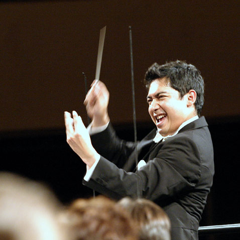

## Rolle, Verantwortung und Handlungsmöglichkeiten

Fachkompetenz allein reicht in Führungsverantwortung nicht aus. Führung verlangt auch eine reife Persönlichkeit und hohe soziale Kompetenz. In meiner Beratungsarbeit gehen Coaching und Leitungssupervision eine produktive Verbindung ein.

Dabei geht es nicht allein um das Einüben wichtiger Schlüsselkompetenzen und die Entwicklung von Lösungen. Ebenso wichtig ist die Reflexion der eigenen Rolle, Position, Befürchtungen und Unsicherheiten. So kann ein tieferes Verständnis der eigenen Position entstehen.

## Verstehen und verinnerlichen

Lösungsansätze wirken nachhaltiger, wenn sie sorgsam reflektiert, wirklich verstanden und verinnerlicht werden. Dabei bin ich Sparringspartnerin zum Vor- und Nachdenken für Entscheiderinnen und Entscheider.

[Führungssituation besprechen](/kontakt)
